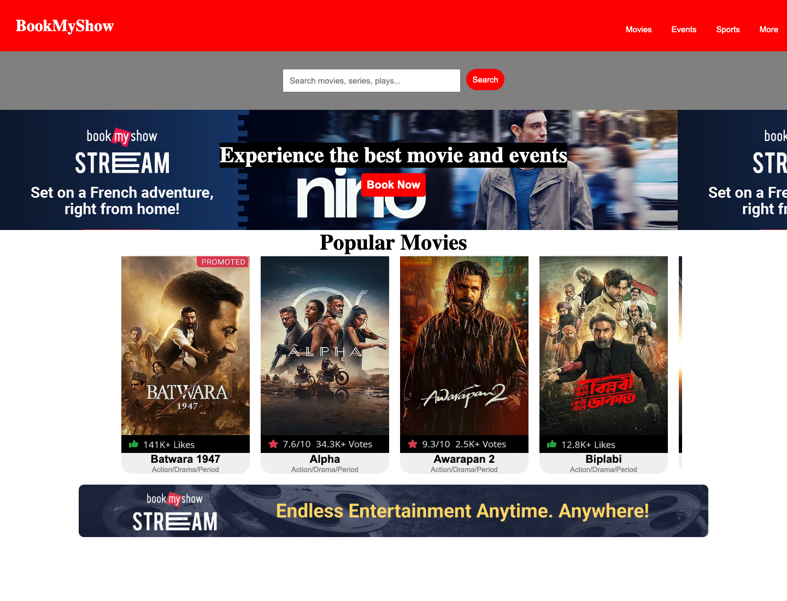

# 🎬 BookMyShow Clone (Day 12 Project)

A simple and responsive frontend clone of the **BookMyShow** homepage built using **HTML5** and **CSS3**. This project demonstrates core CSS concepts such as Flexbox layout, horizontal card scrolling, buttons, media queries, and clean styling.

---

## 📸 Output Preview

Here is the complete output preview of the project:



---

## 🚀 Features

- **Top Navigation Bar:** Distinct red header with brand title (`BookMyShow`) and category buttons (*Movies*, *Events*, *Sports*, *More*).
- **Search Bar Section:** Central search input box with an active red action button.
- **Hero Banner:** Eye-catching promo section with dynamic background image and a "Book Now" call-to-action button.
- **Popular Movies Section:** Horizontal scrollable movie list showcasing posters, ratings/likes badges, titles, and genre tags.
- **Promo Stream Footer:** Promotional bottom banner highlighting stream content.
- **Mobile Responsive Design:** Media queries (`@media (max-width: 615px)`) to optimize layout on mobile and smaller screen sizes.

---

## 📁 Project Structure

```text
Day12 bookmyshow project/
├── Readme.md               # Project documentation and output preview
├── index.html              # HTML structure of the page
├── style.css               # Styling rules and responsive design
└── assets/                 # Image assets and poster graphics
    ├── Alpha.png
    ├── awarapan2.png
    ├── batwara.png
    ├── biplobi.png
    ├── foter.png
    ├── hero.png
    ├── output.png          # Output screenshot
    ├── spidderman.png
    └── the-end-of-oak.png
```

---

## 🛠️ Technologies Used

- **HTML5:** Semantic elements, structure, inputs, and image containers.
- **CSS3:** Flexbox layout (`display: flex`, `justify-content`, `align-items`), `overflow-x: scroll`, background image sizing, button styling, and media queries.

---

## 🔍 Project Analysis & Key Observations

### ✨ Strengths
1. **Clean Flexbox Usage:** Successfully uses Flexbox for headers, hero sections, and card alignments.
2. **Horizontal Movie Card List:** Implements `overflow-x: scroll` (and `overflow-x: auto` on mobile) to create a smooth slider-style movie catalog.
3. **Responsive Thinking:** Includes `@media` queries to adjust header navigation and card spacing on mobile viewports.

### 💡 Suggestions for Improvement
1. **Semantic HTML:** 
   - Use `<nav>` and `<a>` tags instead of nested `<button><p>` tags in the header.
   - Update `<title>Document</title>` in `index.html` to `<title>BookMyShow - Movie Tickets & Events</title>`.
2. **Typography & Styling:**
   - Link Google Fonts (such as *Roboto* or *Inter*) for a more polished look.
   - Add `scrollbar-width: none` or custom `::-webkit-scrollbar` styling to hide or polish the horizontal scrollbar.
3. **Asset & Class Naming:**
   - Correct minor naming typos (e.g., `foter` ➔ `footer`, `spidderman.png` ➔ `spiderman.png`).

---

## 💻 How to Run Locally

1. Clone or download this repository.
2. Open the folder `Day12 bookmyshow project` in VS Code or your preferred editor.
3. Open `index.html` in your browser (or use VS Code **Live Server** extension).
