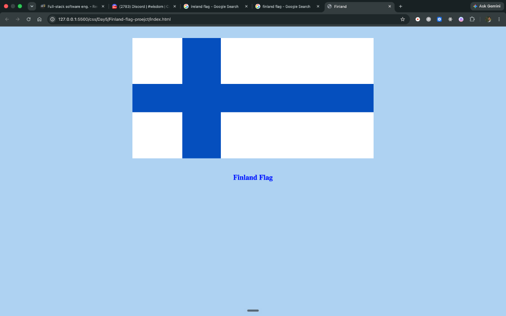

# 🇫🇮 Finland Flag Project

A CSS practice project creating the national flag of Finland using pure HTML and CSS.

---

## 📸 Output



---

## 🛠️ Technologies Used

- **HTML5**: Semantic document structure
- **CSS3**: 
  - Flexbox layout (`flex-direction`, `align-items`)
  - Inline-block element positioning
  - Box model margins and dimensions

---

## 🚀 How to Run

1. Clone the repository:
   ```bash
   git clone https://github.com/Dhrubaraj-Roy/coding-for-class-8.git
   ```
2. Navigate to the project directory:
   ```bash
   cd css/Day5/Finland-flag-proejct
   ```
3. Open `index.html` in your browser (or use Live Server in VS Code).
