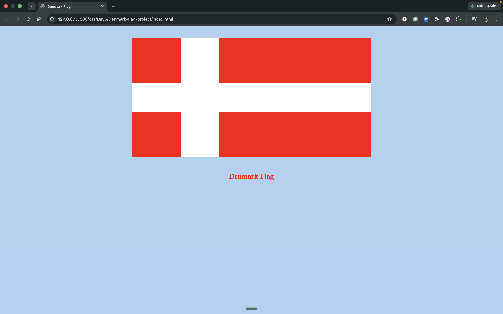
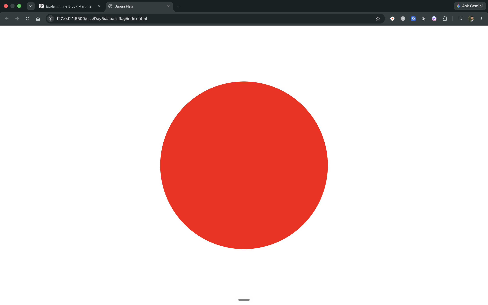

# 🏁 Day 5 — CSS Flag Projects

Day 5 is all about recreating real-world country flags using only **HTML** and **CSS**. These projects practice CSS positioning, `inline-block` layout, `margin` spacing, `border-radius`, and `background-color` styling — no images used for the flag designs!

---

## 1. 🇩🇰 Denmark Flag

A recreation of the **Danish flag (Dannebrog)** — a red banner with an off-centre white Scandinavian cross. Four red `div` blocks are arranged inside a white container using `inline-block` and margins to form the cross pattern.

**CSS concepts used:** `inline-block`, `margin`, `background-color`, Flexbox centering.

### Output



---

## 2. 🇫🇮 Finland Flag

A recreation of the **Finnish flag** — a white banner with a blue Nordic cross. The same four-div layout technique is used, but with a blue container and white blocks revealing the cross. The colour scheme is inverted compared to the Denmark flag.

**CSS concepts used:** `inline-block`, `margin`, `background-color`, Flexbox centering.

### Output


---

## 3. 🇯🇵 Japan Flag

A recreation of the **Japanese flag (Nisshōki)** — a white background with a red circle in the centre. This is the simplest of the three projects, using a single `div` with `border-radius: 50%` to create a perfect circle, centred on the page with `margin: auto`.

**CSS concepts used:** `border-radius`, `margin: auto`, viewport units (`vh`).

### Output



---

## 📂 Folder Structure

```
Day5/
├── Denmark-flag-project/
│   ├── assets/
│   │   └── image.png
│   ├── index.html
│   └── style.css
├── Finland-flag-proejct/
│   ├── assets/
│   │   └── output.png
│   ├── index.html
│   └── style.css
├── Japan-flag/
│   ├── assets/
│   │   └── image.png
│   ├── index.html
│   └── style.css
└── README.md
```
