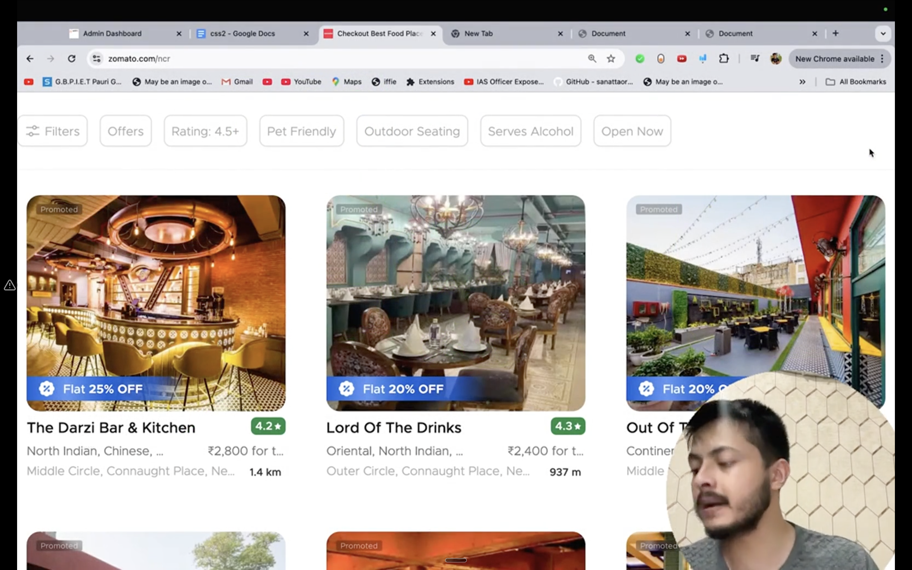
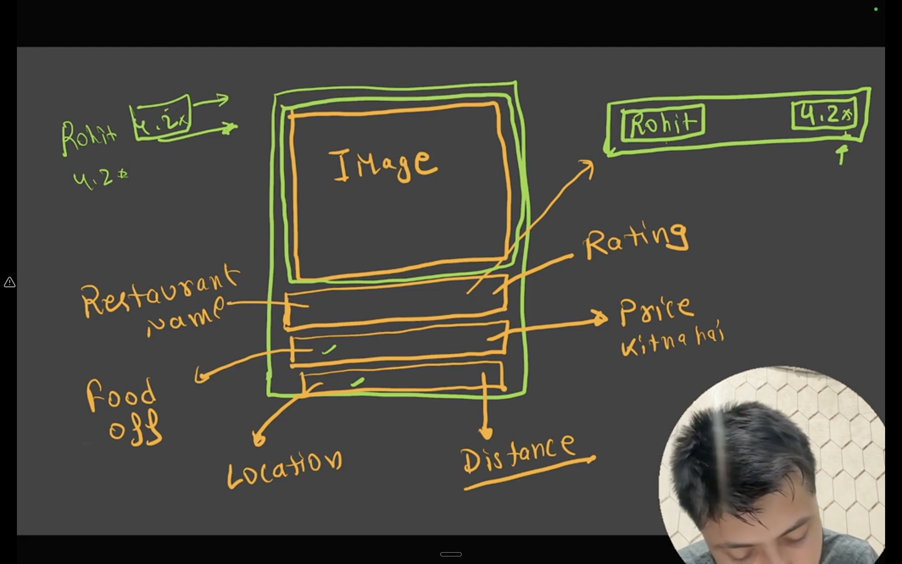

# 🍽️ Day 8 & 9: Zomato Clone (Header & Restaurant Card UI Project)

A clean, modular, and responsive frontend implementation inspired by the **Zomato** web app, built using pure **HTML5** and **CSS3**. 

This project covers the complete header navigation bar and the structured 4-container restaurant card grid layout.

---

## 📸 Output

Here is the complete output of the project:


---

## 🎯 Design Goal & Wireframe

| 🎯 Target Design Reference | 📐 4-Container Wireframe Concept |
| :---: | :---: |
|  |  |

---

## 🏗️ Architecture & Component Breakdown

The project is structured into two main components: the **Top Navigation Header** and the **Modular Restaurant Cards**.

```
┌────────────────────────────────────────────────────────────────────────────────────────┐
│  HEADER                                                                                │
│  [ zomato (Logo) ]     [ Search for resturent... (Input) ]      [ Login ]  [ Sign up ] │
└────────────────────────────────────────────────────────────────────────────────────────┘

┌──────────────────────────────────────────────┐
│  RESTAURANT CARD (.card)                     │
│ ┌──────────────────────────────────────────┐ │
│ │  Container 1 (.con1)                     │ │
│ │  [ Restaurant Image ]                    │ │
│ │  [ Offer Tag: "Flat 20% off" (Absolute) ]│ │
│ ├──────────────────────────────────────────┤ │
│ │  Container 2 (.con2)                     │ │
│ │  Restaurant Name (Left) | Rating (Right) │ │
│ ├──────────────────────────────────────────┤ │
│ │  Container 3 (.con3)                     │ │
│ │  Cuisine Type (Left)    | Price (Right)  │ │
│ ├──────────────────────────────────────────┤ │
│ │  Container 4 (.con4)                     │ │
│ │  Location (Left)        | Distance(Right)│ │
│ └──────────────────────────────────────────┘ │
└──────────────────────────────────────────────┘
```

---

### 1. 🧭 Navigation Header (`<header>`)
The top header provides standard food delivery platform navigation using inline-block alignment:
- **Brand Logo (`.brand-name`)**: Distinct italic typography using system font stacks at `50px` font size.
- **Search Bar (`.searching`)**: Interactive text input field with placeholder *"search for resturent"*, custom padding, and border outlines.
- **Auth Action Buttons (`.btn-login`, `.btn-signup`)**: Borderless, transparent action buttons with gray text styling and pointer cursor.

---

### 2. 🧱 4-Container Restaurant Card (`.card`)

Each restaurant card is modularized into 4 distinct containers for clean separation of concerns:

#### 🔹 **Container 1 (`.con1`) - Cover Image & Promo Badge**
- Displays restaurant cover image (`.img`) with rounded corners (`border-radius: 20px`).
- Features a floating translucent blue offer tag (`.offer-box` - *"Flat 20% off"*) placed at the bottom-left corner using `position: absolute`.

#### 🔹 **Container 2 (`.con2`) - Name & Rating**
- **Left**: Restaurant title (`.res-name`) styled with bold typography.
- **Right**: Green rating pill (`.rating` - `4.3*`) aligned to the right edge via absolute positioning.

#### 🔹 **Container 3 (`.con3`) - Cuisine & Price**
- **Left**: Cuisine description (`.food-name` - *"North Indian"*) in subtle gray.
- **Right**: Average pricing (`.price` - *"₹200 for two"*) aligned right.

#### 🔹 **Container 4 (`.con4`) - Location & Delivery Distance**
- **Left**: Neighborhood / Area name (`.location` - *"Salbari"*) in muted gray.
- **Right**: Delivery distance (`.distance` - *"3.4km"*) aligned right.

---

## ✨ CSS Concepts & Techniques Used

- **CSS Positioning**:
  - `position: relative` on parent containers (`.con1`, `.con2`, `.con3`, `.con4`, `.searching`) to establish local coordinate contexts.
  - `position: absolute` for pinning badges, prices, ratings, and distances precisely to their respective container edges (`top`, `bottom`, `left`, `right`).
- **Box Model & Universal Reset**:
  - Universal reset `* { margin: 0; padding: 0; box-sizing: border-box; }` for consistent layout calculations.
  - Custom padding and margin rhythm across header elements and cards.
- **Display & Layout**:
  - `display: inline-block` on `.box` and `.card` elements for horizontal inline flows and responsive multi-column card grids.
- **Interactive Micro-Animations**:
  - Smooth `:hover` transition on `.card` providing card elevation with `box-shadow: 2px 2px 2px rgb(216, 212, 212)` and a crisp white background highlight.
- **Typography & Styling**:
  - Modern font stacks (`system-ui`, `Segoe UI`).
  - Soft contrast body background (`rgb(231, 239, 246)`).
  - Modern rounded aesthetic (`border-radius: 20px`).

---

## 📂 Project Structure

```
Day8 and 9/
├── assets/
│   ├── gupchup.png      # Restaurant card banner image
│   ├── image.png        # Architecture wireframe note
│   ├── image-1.png      # Reference inspiration
│   └── output.png       # Complete project output screenshot
├── index.html           # HTML5 structure (Header + 7 Restaurant Cards)
├── style.css            # CSS rules for navigation bar & cards
└── Readme.md            # Project documentation
```

---

## 🛠️ Technologies Used

- **HTML5**: Semantic layout markup (`<header>`, `<input>`, `<button>`, `<div>`, `<p>`)
- **CSS3**: Layout, positioning, typography, box-model, and hover transitions

---

## 🚀 How to Run

1. Clone the repository:
   ```bash
   git clone https://github.com/Dhrubarajroy/coding-for-class-8.git
   ```
2. Navigate to the Day 8 and 9 directory:
   ```bash
   cd "css/Day8 and 9"
   ```
3. Open `index.html` in your browser (or use **Live Server** in VS Code).