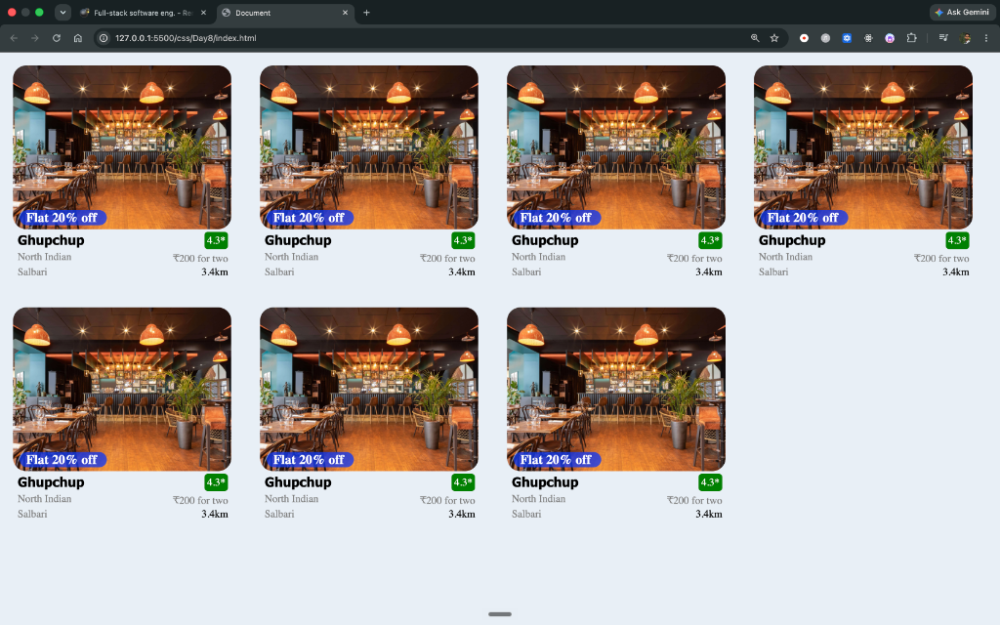

# 🍽️ Day 8: Restaurant Card UI Project (Zomato Clone)

A modular, responsive restaurant card component inspired by food delivery platforms like **Zomato**, created with pure **HTML5** and **CSS3**.

---

## 📸 Output

Here is the final output of the project:



---

## 🎯 Design Goal & Wireframe

| 🎯 Target Design Reference | 📐 4-Container Wireframe Concept |
| :---: | :---: |
|  |  |

---

## 🧱 Component Architecture (4-Container Breakdown)

Each restaurant card is organized into **4 structured containers** to achieve a clean and modular layout:

```
┌──────────────────────────────────────────────┐
│  Container 1 (.con1)                         │
│  [ Restaurant Image ]                        │
│  [ Offer Badge: "Flat 20% off" (Absolute) ]  │
├──────────────────────────────────────────────┤
│  Container 2 (.con2)                         │
│  Restaurant Name (Left)  |  Rating (Right)   │
├──────────────────────────────────────────────┤
│  Container 3 (.con3)                         │
│  Cuisine Type (Left)     |  Price (Right)    │
├──────────────────────────────────────────────┤
│  Container 4 (.con4)                         │
│  Location (Left)         |  Distance (Right) │
└──────────────────────────────────────────────┘
```

### 1. **Container 1 (`.con1`) - Image & Promotional Offer**
- Displays the restaurant cover image (`.img`) with rounded corners (`border-radius: 20px`).
- Features a floating offer tag (`.offer-box` - *"Flat 20% off"*) layered over the image using `position: absolute` at the bottom-left corner with an attractive translucent blue background.

### 2. **Container 2 (`.con2`) - Name & Rating**
- **Left**: Restaurant title (`.res-name`) styled with bold typography.
- **Right**: Highlighting the rating badge (`.rating` - `4.3*`) in green with rounded corners and absolute positioning.

### 3. **Container 3 (`.con3`) - Cuisine & Price**
- **Left**: Cuisine description (`.food-name` - *"North Indian"*) in subtle gray.
- **Right**: Average pricing (`.price` - *"₹200 for two"*), aligned to the right edge.

### 4. **Container 4 (`.con4`) - Location & Distance**
- **Left**: Neighborhood / Area name (`.location` - *"Salbari"*).
- **Right**: Real-time delivery distance (`.distance` - *"3.4km"*), positioned on the right.

---

## ✨ CSS Concepts & Techniques Used

- **CSS Positioning**:
  - `position: relative` on parent containers (`.con1`, `.con2`, `.con3`, `.con4`) to establish local coordinate systems.
  - `position: absolute` for precise alignment of offer tags, rating badges, prices, and distances.
- **CSS Box Model & Reset**:
  - Universal reset `* { margin: 0; padding: 0; box-sizing: border-box; }` for consistent sizing.
  - Custom padding and margin adjustments across elements.
- **Layout**:
  - `display: inline-block` on `.card` to effortlessly form a multi-column card grid.
- **Micro-Interactions**:
  - Smooth `:hover` effects on `.card` providing subtle elevation with `box-shadow` and background highlight.
- **Visual Styling**:
  - Soft background (`#e7eff6`) on `body` for contrast.
  - Rounded aesthetic (`border-radius: 20px`) for modern card feel.

---

## 📂 Project Structure

```
Day8/
├── assets/
│   ├── gupchup.png      # Restaurant card banner image
│   ├── image.png        # Architecture wireframe note
│   ├── image-1.png      # Reference inspiration
│   └── output.png       # Final rendered output screenshot
├── index.html           # HTML5 structure with 7 restaurant cards
├── style.css            # CSS styling and card layout rules
└── Readme.md            # Project documentation
```

---

## 🛠️ Technologies Used

- **HTML5**: Semantic layout and markup
- **CSS3**: Modern styling, positioning, box model, and hover effects

---

## 🚀 How to Run

1. Clone the repository:
   ```bash
   git clone https://github.com/Dhrubarajroy/coding-for-class-8.git
   ```
2. Navigate to the Day 8 directory:
   ```bash
   cd css/Day8
   ```
3. Open `index.html` in your favorite browser (or use **Live Server** in VS Code).