# 🎨 CSS — Learning Journey

A collection of **15 days** of CSS practice projects, progressing from basic styling fundamentals to advanced animations and real-world UI clones. Each Day folder contains HTML and CSS files along with output screenshots.

---

## 📅 Day 2 — CSS Basics & Selectors

Introduction to CSS fundamentals — linking stylesheets, `font-family`, `font-size`, and styling headings & list items.

**Concepts:** External stylesheets, `font-family`, `font-size`, selectors.


---

## 📅 Day 3 — Typography & Google Fonts

Exploring CSS typography properties like `line-height`, `letter-spacing`, `word-spacing`, and integrating **Google Fonts** (`Roboto Flex`) with `font-stretch`.

**Concepts:** Google Fonts, `font-stretch`, `line-height`, `letter-spacing`, viewport units.

---

## 📅 Day 4 — Box Model & Styling

Practising the CSS box model — margins, padding, borders, and background colours on HTML elements.

**Concepts:** Box model, `margin`, `padding`, `border`, `background-color`.

### Output

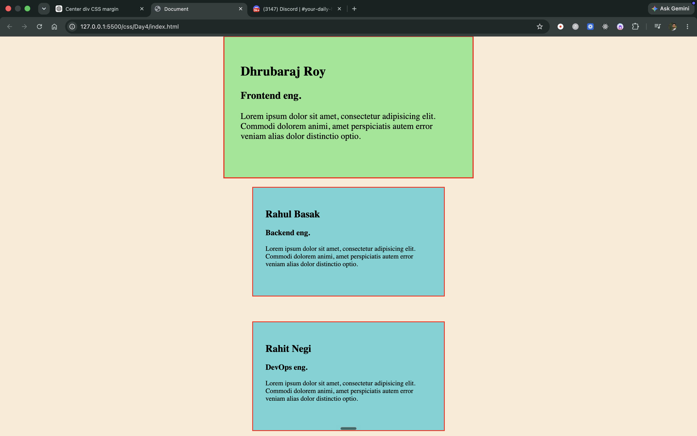

---

## 📅 Day 5 — Flag Projects (Denmark 🇩🇰, Finland 🇫🇮, Japan 🇯🇵)

Recreating three country flags using only HTML `div` elements and CSS — practising `inline-block` layout, margins, `border-radius`, and colour styling.

**Concepts:** `inline-block`, `margin`, `border-radius`, `background-color`, Flexbox centering.

### Output

| Denmark | Finland | Japan |
| :---: | :---: | :---: |
|  |  |  |

---

## 📅 Day 6 — Positioning & Fixed Header

Learning CSS positioning (`sticky`, `fixed`, `relative`) with a box layout exercise and a **fixed header** project.

**Concepts:** `position: sticky`, `position: fixed`, `inline-block`, `top`, `left`.

### Output

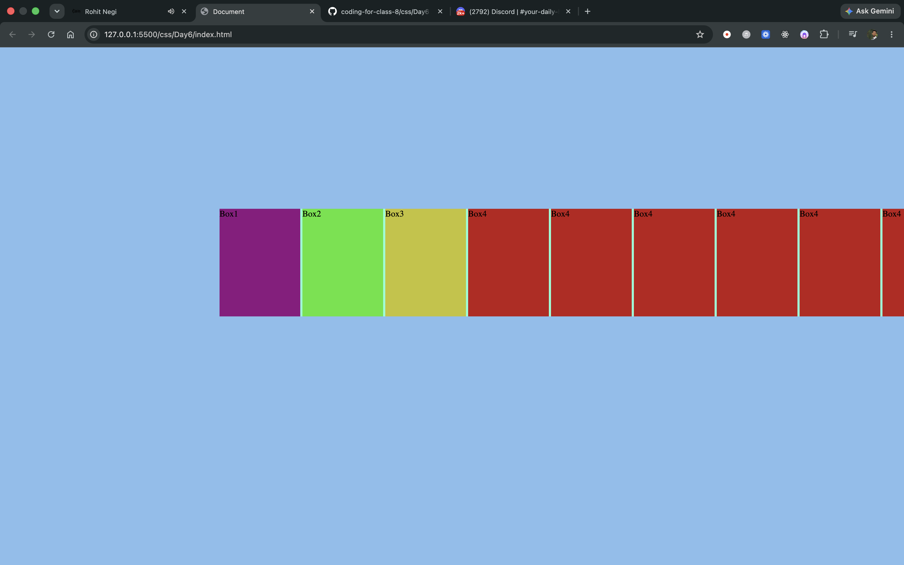

---

## 📅 Day 7 — Overflow & Scrolling

Understanding the `overflow` property — creating scrollable containers with `overflow: scroll` on fixed-size `div` elements.

**Concepts:** `overflow: scroll`, fixed `height`/`width`, `font-size`.

### Output

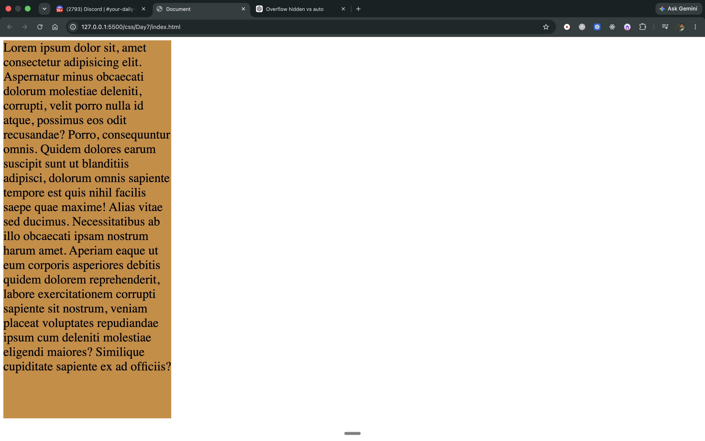

---

## 📅 Day 8 & 9 — Zomato Clone 🍽️

A real-world project — building a **Zomato-inspired** food delivery UI with a navigation header, search bar, and horizontal restaurant card grid using Flexbox.

**Concepts:** Flexbox, `position: absolute`, `inline-block`, box-shadow hover effects, `border-radius`.

### Output

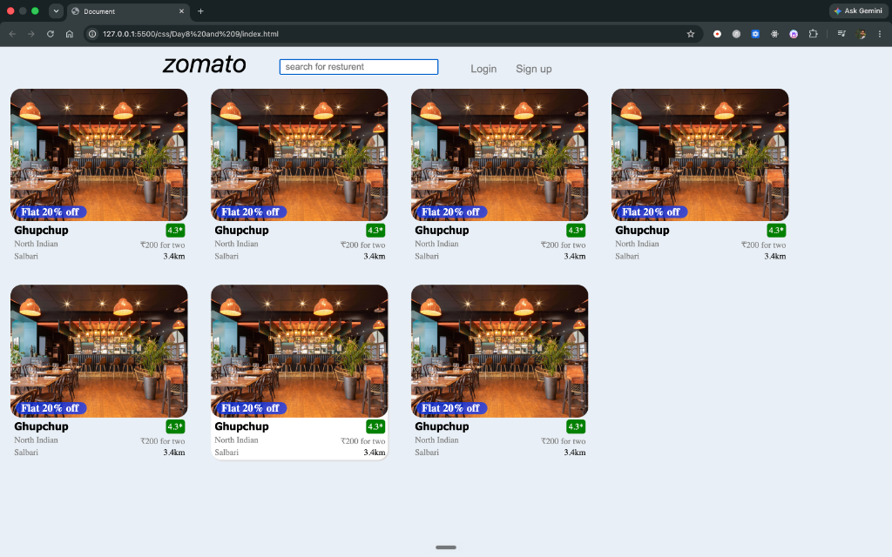

---

## 📅 Day 10 — Flexbox Basics

Introduction to **Flexbox** — `display: flex`, `flex-direction`, `flex-wrap`, and arranging coloured boxes in a flex container.

**Concepts:** `display: flex`, `flex-direction: row`, `flex-wrap`, `border`, `margin`.

### Output

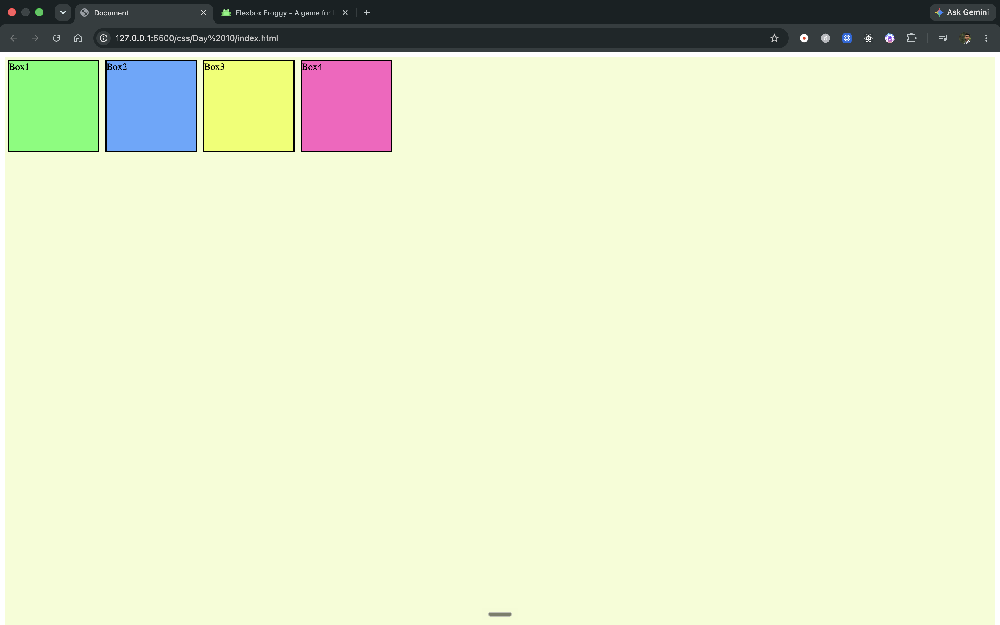

---

## 📅 Day 11 — Flexbox Advanced & Media Queries

Deep dive into Flexbox item properties (`order`, `flex-grow`, `flex-shrink`, `flex-basis`, `align-self`) and implementing **responsive design** with `@media` queries.

**Concepts:** `justify-content`, `align-items`, `align-self`, `@media` queries, responsive design.

### Output

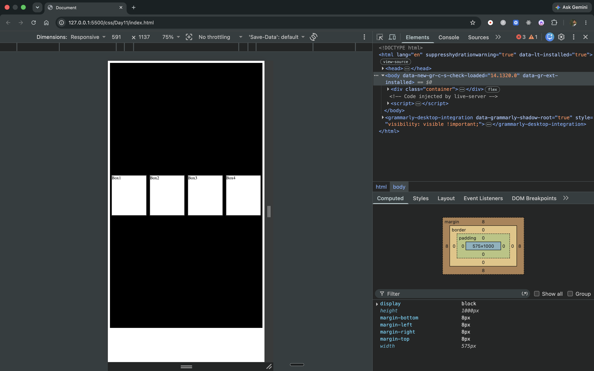

---

## 📅 Day 12 — BookMyShow Clone 🎬

A responsive frontend clone of **BookMyShow** featuring a top nav bar, hero banner, horizontally scrollable movie card list, and mobile-responsive layout.

**Concepts:** Flexbox layout, `overflow-x: scroll`, `background-image`, `@media` queries, responsive buttons.

### Output


---

## 📅 Day 13 — Text Styling & CSS Transitions

Exploring text decoration properties and adding smooth **CSS transitions** on hover — `text-shadow` with animated transition effects.

**Concepts:** `text-shadow`, `transition-property`, `transition-duration`, `transition-timing-function`, `:hover`.

### Output

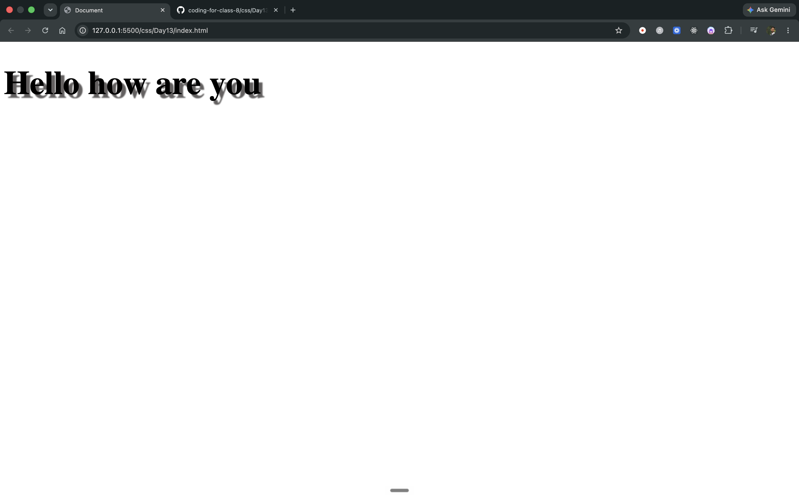

---

## 📅 Day 14 — CSS Grid Layouts & Chessboard ♟️

Introduction to **CSS Grid** — building a page layout with header, sidebar, and footer spanning multiple grid columns/rows. Also includes a **chessboard** built entirely with CSS Grid.

**Concepts:** `display: grid`, `grid-template-columns`, `grid-column`, `grid-row`, `gap`, `fr` units.

### Output

| Grid Layout | Chessboard |
| :---: | :---: |
| 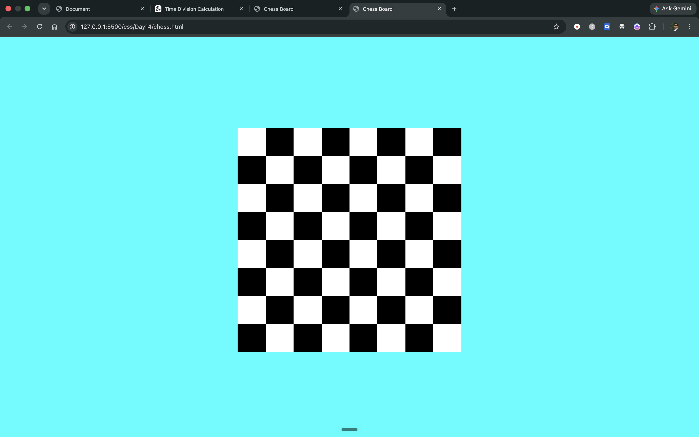 | 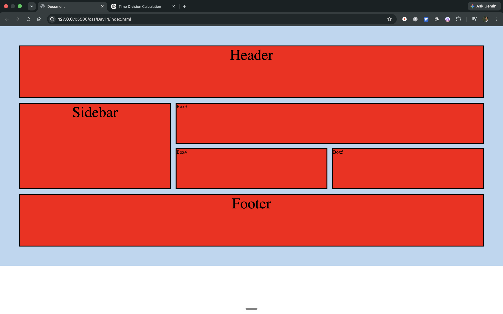 |

---

## 📅 Day 15 — CSS Grid Advanced

Advanced CSS Grid practice — `grid-template-areas`, `place-items`, `justify-self`, `align-self`, and building complex multi-row/column grid layouts.

**Concepts:** `grid-template-columns: repeat()`, `grid-template-rows`, `place-items`, `justify-self`, `align-self`.

### Output

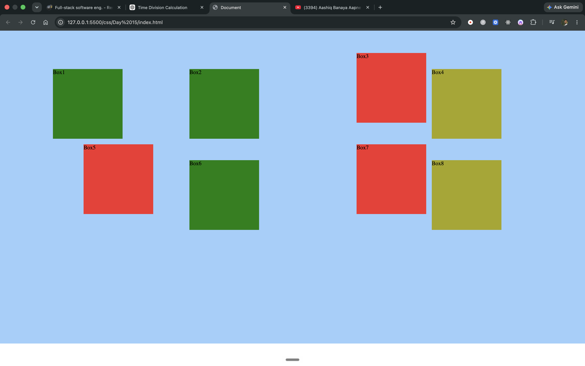

---

## 📅 Day 16 — CSS Transforms & Transitions

Practising CSS **transform** functions — `translate`, `scale`, `rotate`, `skew` — combined with smooth `transition` effects on hover.

**Concepts:** `transform: translate/scale/rotate/skew`, `transition`, Flexbox centering.

### Output

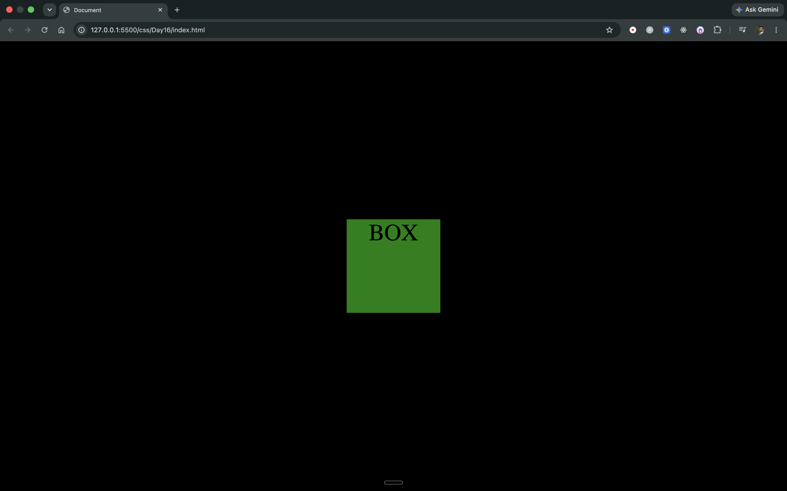

---

## 📅 Day 17 — CSS Animations & Solar System 🌍

Learning **CSS keyframe animations** — creating a box that animates in a diamond path using `@keyframes` and `transform: translate()`. Includes a **Solar System** project with orbiting planets.

**Concepts:** `@keyframes`, `animation-name`, `animation-duration`, `animation-iteration-count`, `transform: translate()`.

### Output

| Animation Exercise | Solar System Project |
| :---: | :---: |
|  |  |

---

## 📂 Folder Structure

```
css/
├── Day2/               # CSS Basics & Selectors
├── Day3/               # Typography & Google Fonts
├── Day4/               # Box Model & Styling
├── Day5/               # Flag Projects (Denmark, Finland, Japan)
├── Day6/               # Positioning & Fixed Header
├── Day7/               # Overflow & Scrolling
├── Day8-9/             # Zomato Clone Project
├── Day10/              # Flexbox Basics
├── Day11/              # Flexbox Advanced & Media Queries
├── Day12 bookmyshow project/  # BookMyShow Clone
├── Day13/              # Text Styling & Transitions
├── Day14/              # CSS Grid & Chessboard
├── Day15/              # CSS Grid Advanced
├── Day16/              # Transforms & Transitions
├── Day17 solar project/       # Animations & Solar System
└── README.md
```

---

## 🛠️ Technologies Used

- **HTML5** — Semantic structure and markup
- **CSS3** — Styling, layouts, animations, and responsive design

## 🚀 How to Run

1. Clone the repository:
   ```bash
   git clone https://github.com/Dhrubaraj-Roy/coding-for-class-8.git
   ```
2. Navigate to any Day folder and open `index.html` in your browser (or use **Live Server** in VS Code).
