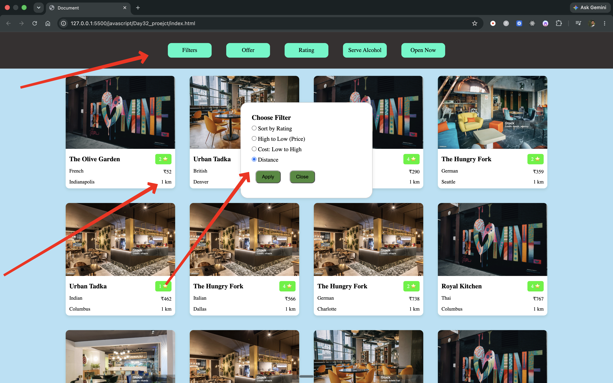

<!-- <.-- Data →→> -->
1: Restaurant Image
2: Restaurant Name
3: Rating
4: Food_type
5: Price_for_two
6: Location
7: Distance_from_Customer_house
8: Offers
9: Alchol_serves
10: Restaurant_open_time
11: Restaurant_close_time

<!-- 100 dummy data  create -->

<!-- card map -->

