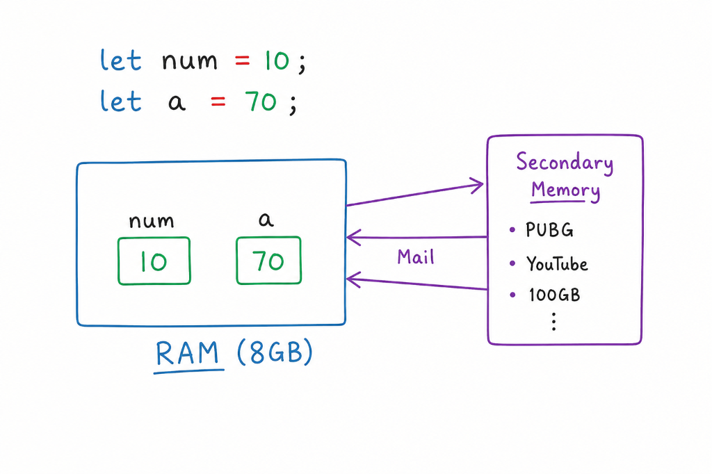

# JavaScript Class for Class 8

Materials and exercises for Class 8 JavaScript lessons.

## 📝 Today's Class Notes

* **V8 Engine**: Google's JavaScript engine that makes JS run fast by compiling code directly to machine code inside browsers like Chrome.
* **Node.js and V8 Engine**: Node.js uses Google's V8 engine to let you run JavaScript code directly on your computer, instead of just inside a web browser.
* **Node.js Versions**: When installing Node.js, always choose the **LTS (Long Term Support)** version because it is stable and safe to use. The "Current" version contains new features that are still being tested and might break your code.

## 🧠 Memory Allocation (RAM vs. Secondary Memory)

* **RAM vs. Secondary Memory**: Programs (like PUBG or YouTube) are stored in Secondary Memory and loaded into RAM when running.
* **JavaScript Variables**: Declaring variables (like `let num = 10;`) allocates temporary storage space directly inside RAM.
* **Undefined Variables**: If we declare a variable without assigning a value (e.g., `let a;`), it is stored in RAM with a default value of `undefined`. Printing it using `console.log(a);` will output `undefined`.
* **Null vs. Undefined**: `undefined` means we forgot to set a value for a variable, while `null` means we intentionally set its value to be empty.

